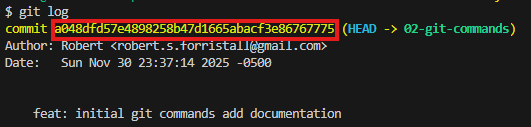
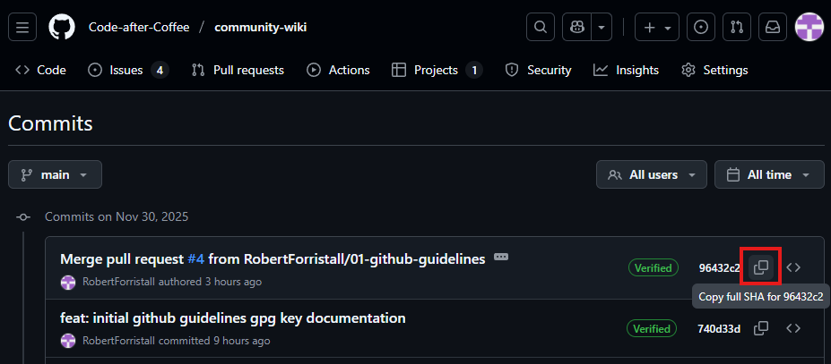

# Cherry Pick

The git cherry-pick command is used to pull a single commit from a different local/remote branch into your current branch.

This can be useful in code reviews along with handling situations where only a select few commits are needed from one branch onto another without pulling all of the differeing changes.

To cherry pick first switch the active branch to the one that will recieve the commit using [checkout](./checkout.md) then use:

`git cherry-pick <commit-hash>`

Where the commit-hash can be obtained from the `git log` command or on Github if it is from a remote branch.

## Local commit hash

Example: `git cherry-pick a048dfd57e4898258b47d1665abacf3e86767775`

## Remote commit hash

Example: `git cherry-pick 96432c2a8a6e08283993ca5b712620e3303c1c53`

## Example

