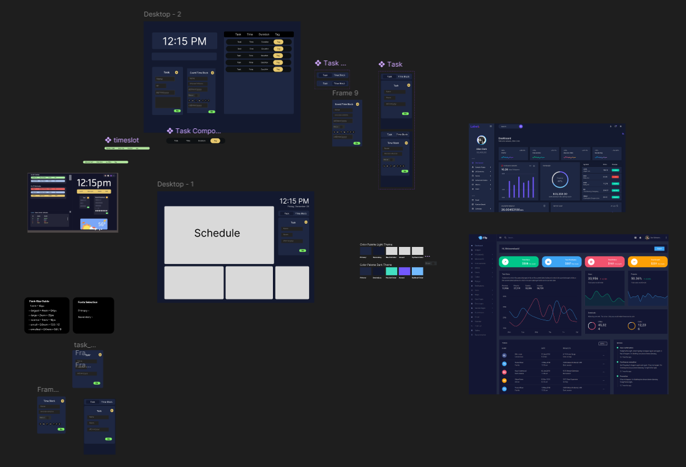

# Design

Upon the completion of a proposal it is time to enter the detailed design phase of the project where any undocumented design philosophies for the project should be documented and finalaized.

This can include a number of different items but some of the most commonly included ones are documented below:

## System Design Document (SDD)

A system design document aims to document all of the detailed and intricate aspects of the projects systems including things such as hardware, integrations between components and subsystems, data designs, and much more. Where as the initial design document mentioned in the proposal went over the why of the project with a little bit on the how; a system design document focuses entirely on how the project will be implemented by ensuring at any aspects of the technical requirements of the project are addressed and documented.

Most system design documents include sections on some of the following based on the needs of the project:

1. System Architecure: High level diagrams such as flow charts detailing any major components/systems of the project and how they interact with each other.
2. Data Design: Descriptions of data structures and their flow throughout different systems of the project.
3. Database Design: Descriptions of the database schemas along with entity relationship diagrams mapping out relations between database collections.
4. API Specifications: Specifications of any APIs including request data structures and response results.
5. External Service Integrations: Any integrations that need to be made with external services including data exchange policies and limitations.
6. User Interfaces: Documentation of user interfaces such as designs and pipelines for user experience when interacting with the project.
7. Scalability Designs: Documentation on plans for handling potential future scalability plans to ensure that the project can grow as needed
8. Security Designs: Documentation of security plans to ensure that user data and project critical data is protected
9. Performance Designs: Documentation outlining performance of the project and its desired performance metrics
10. Reliability Designs: Documentation on how the project will remain reliable such as methods for handling service outages and performance related attacks

## UI/UX Design Template

For any project that will include a frontend component of the project that will be interacted with by a dedicated user then, there should be a detailed and dedicated documentation of what the user experience will look like and how interacting with the UI will be handled. By formalizing a concrete understanding of how a user will interact with the project it will be easier to document any data needs for the project along with ensure that all necessary components that must be presented to the user are accounted for and presented. The other key advantage of such documentation comes from easily being able to iterate over different styling changes to the frontend components of the system while also providing a blueprint for handling that styling in the code itself.

While there are many tools that can be used to achieve this goal; one of the most popular and widely used in the industry is [Figma](https://www.figma.com/)

Example image from a previous project I was a part of:
